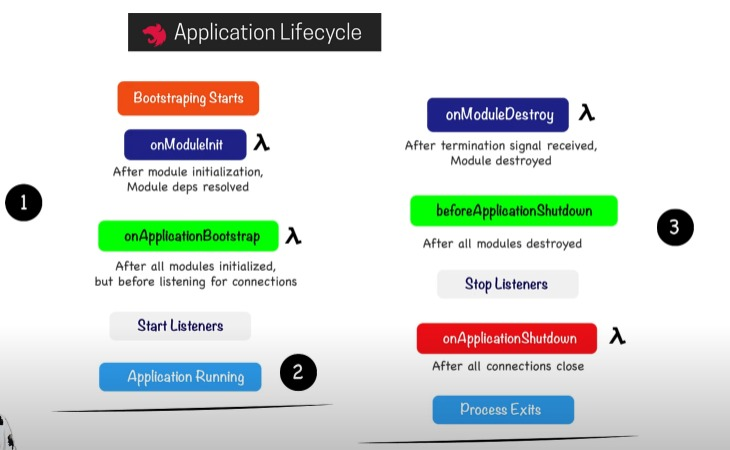
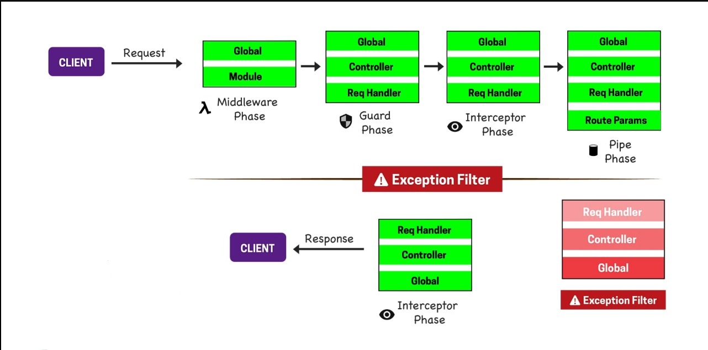

# NestJS
**Sending Response :**
```js
//Without response injection
@Controller('/users')
@Post('/profile')
// here we have injected only request and not response then we can send response of the api only by returning from the function
getProfile(@Req req: Request){
  return {hello:"world"}
}


// With response injection
@Controller('/users')
@Post('/profile')
// here we have injected Response, it means we have to use Response object to send the response of the API. If we use return statement then API reponse will not be returned
getProfile(@Req req: Request,@Res res:Response){
  res.json({hello:"world"})
}

// With response injection and return 
@Controller('/users')
@Post('/profile')
// here we have injected Response, if we have to return API response using return statement then we have to use {passthrough:true}
getProfile(@Req req: Request,@Res({passthrough:true}) res:Response){
   return {hello:"world"}
}
```
---
**Redirect Response** :
- **Static Redirection:** Using **@Redirect** decorator
```js
@Controller('/users')
@Post('/profile')
@Redirect('/users/account')
getProfile(@Req req: Request,@Res({passthrough:true}) res:Response){
   return {hello:"world"}
}
```
- **Dynamic Redirection:** Using **url** in return statement
```js
@Controller('/users')
@Post('/profile')
getProfile(@Req req: Request,@Res({passthrough:true}) res:Response){
   return {url:/users/account,
           statusCode: 302
   }
}
```

**Route Parameters**
```js
@Controller('/users')
@Get('/profile/:id')
getProfile(@Param() params){
//here we do not pass anything in @Param then params will return an object with key as id and value as passed in API

      return {hello:"world"}
}
```

```js
@Controller('/users')
@Get('/profile/:id')
getProfile(@Param('id') params){
//here the params will be the value of id directly and not the object

      return {hello:"world"}
}
```
---
**Headers:**
**@Header:** To set the header
```js
@Controller('/users')
@Get('/profile/:id')
@Header('Cache-Control','none')
getProfile(@Param('id') params){
      return {hello:"world"}
}
```
**@Headers:** To extract the headers.
```js
@Controller('/users')
@Get('/profile/')
getProfile(@Headers() headers: Record<string:any>){
      return {hello:"world"}
}
```

**DEPENDENCY INJECTION (DI):** 
- It uses IOC such that instead of creating the instance manually we give control to nestjs
- To use DI first we have to register it in the module within providers.
 ```js
 @Module({
      providers: [
      { provide: "STORE", useClass: UsersStore
      
       }
         ]
      })
```

To use this anywhere within module we use **@Inject**(*except when the provide is a class itself*) with the **name given in provide**.

```js
@Controller("users")
export class UsersController {
  constructor(@Inject("STORE") private store: UsersStore) {
    console.log(`[UsersController]:`, this.store.getStore());
  }
}
```

Here instance of UserStore is created and used in controller with the name "STORE"

- We can also use **useValue** and **useFactory** for injection**

- **Scope of DI:**
  - **DEFAULT:** It means only one instance will be created
  - **REQUEST**: It means per request of api, instance will be created. But it also has drawback as the anything which consumes the injection, the instance of that thing is also created which becomes heavy
  - **TRANSIENT:** New dedicated instance for each consumer

---
**Types of Modules :** 
- **Feature Modules:** Can be used per feature. We can do that by creating seperate folders feature wise.
- **Shared Modules:** using exports in the module we can share classes 
 ```js
 @Module({
      providers: [
      { provide: "STORE", useClass: UsersStore
      
       }
         ],
        exports: [UserService] 
      })
```
Now wherever we import this module we can inject UserService there.

- **Global Modules:** By using **@Global** we can make a module global and we do not need to import the module to use there classes. But we have to import in the main module to work.
 ```js
 @Global()
 @Module({
      providers: [
      { provide: "STORE", useClass: UsersStore
      
       }
         ],
        exports: [UserService] 
      })
```
- **Router module:** Provides routes to api within the module. Mention in the app module.
 ```js
 @Global()
 @Module({
      imports:[ JobModule,RouterModule.register([{path:'jobs',module:JobModule}])]
      })
```
We can also use children inside it for route within route.
 ```js
 @Global()
 @Module({
      imports:[ JobModule,RouterModule.register([{path:'jobs',module:JobModule,children:[{path:'finding',module:JobFindingModule}]}])]
      })
      //here path becomes jobs/finding 
```
---
**Pipe**:
Used for two purpose: Transformation and Validation

- **Transformation:**
```js
@Controller('/users')
@Get('/profile/:id')
getProfile(@Param('id', ParseIntPipe) params){
      return {hello:"world"}
}
```
Here **ParseIntPipe** is used to convert dynamic id from string to integer.

```js
@Controller('/users')
@Get('/profile/:id')
@UsePipes(ParseIntPipe)
getProfile(@Param('id') params, QueryParam('category')){
      return {hello:"world"}
}
```
To use pipes for all the parameters we can use **@UsePipes** and mention the transformation that it will be applied to all inputs.

- **ValidationPipe:** We can use ParseUUIDPipe, ParseArrayPipe, ParseEnumPipe, etc. It will validate the input and give error as per validation.

  **Note:** If we use Global pipe then we cannot use DI of pipe options via modules.

---
**Schema Based Validation:** (object validation)
- Can use **joi** package (It does validation but not transformation)
- Can use packages **class-validator** and **class-transformer** (It does validation and transformation )
---
**Application Lifecycle**
- Can be implemented anywhere in module,service,controller,etc
- Destroy will be called on **app.close(**) (Closes nestjs but not nodejs)
- To enable closing nodejs (using ctrl+c) we have to use **app.enableShutdownHooks()** to call distroy methods on any event

---

**Request Response Flow:**



**Middlewares**
- Middleware is a function which is called before the route handler. 
- It has params: request,response,next.
- next() is called so then it can call next method or middleware. if we do not use next then request will be stuck.
- To create middleware we have to implement **NestMiddleware** interface and it has method **use** to be implemented
  ```js
  @Injectable()
  export class LoggerMiddleware implements NestMiddleware {
    use(req: Request, res: Response, next: NextFunction) {
      console.log('Request...');
      next();
    }
  }
  ``` 
- To apply the middleware we have to implement **NestModule** in the module.ts file. It gives a **configure** method to implement.
  ```js
    export class AppModule implements NestModule {
    configure(consumer: MiddlewareConsumer) {
      consumer
        .apply(LoggerMiddleware)
        .forRoutes('cats');
    }
  }
  ```
  We can also use path and method on which the middleware will be applied.
  ```js
    export class AppModule implements NestModule {
    configure(consumer: MiddlewareConsumer) {
      consumer
        .apply(LoggerMiddleware)
        .forRoutes({ path: 'cats', method: RequestMethod.GET });
    }
  }
  ```
- We can also use global middleware in the main.ts file with **use method**. But we cannot use DI for it. For DI either use class or functional middleware.
---
  


